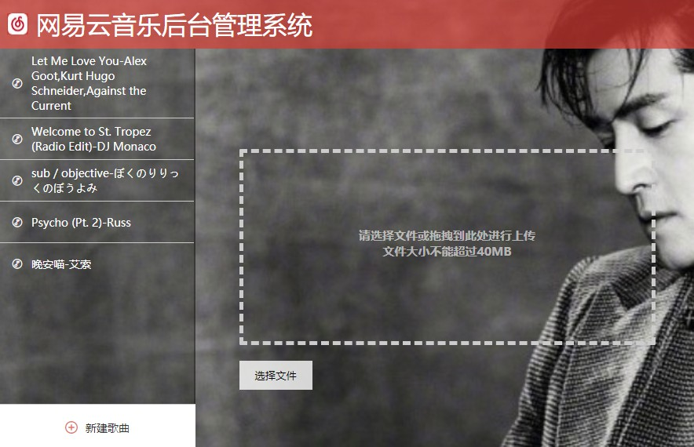
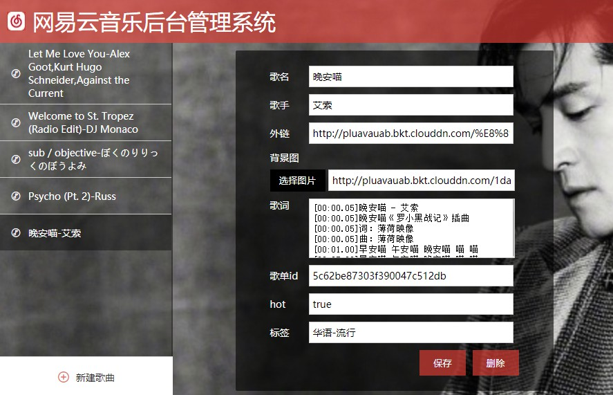
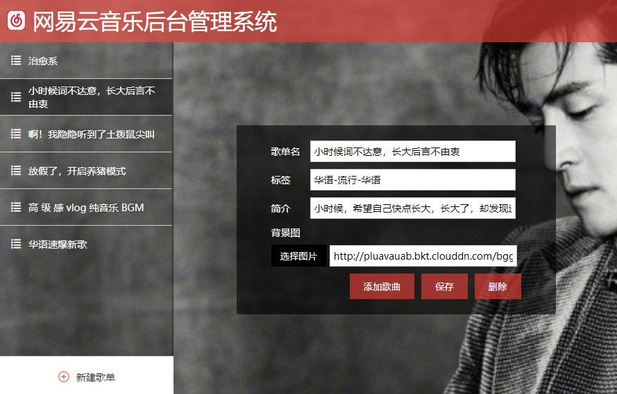
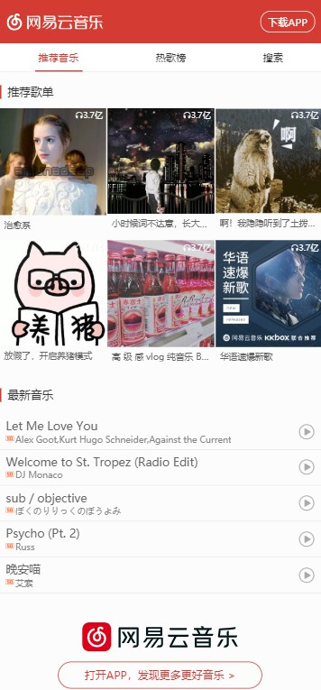
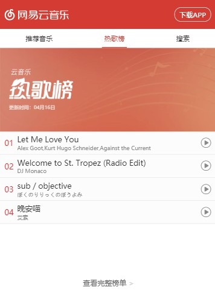
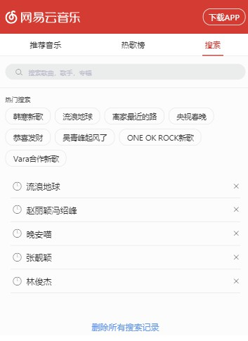
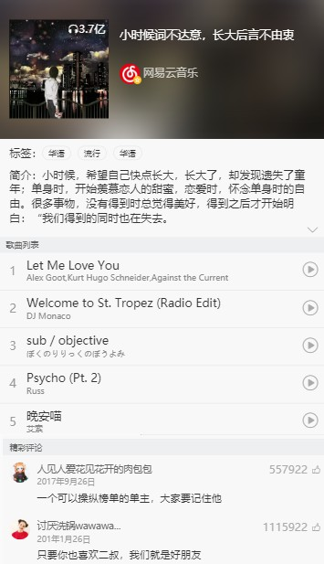

# netease-music
简述：仿移动端网易云音乐，包含后台管理系统，支持上传歌曲，歌词，编辑歌曲，删除等，支持定制歌单。可在线听歌，查看歌词。


## 技能树： 
- 使用语言：html + css + sass + javascript + jquery
- 使用 flex/vw/vh 进行移动端适配，并定制全局 reset.css
- 使用 localStorage 存储用户搜索历史
- 仿 vueJs 构建 MVC 设计模式
- learnCloud 进行数据库存储
- 七牛云文件上传，后台使用 nodeJs 返回uptoken
- 编写 eventHub 发布订阅模式进行各模块间逻辑交互

## 应用启动：
```js
    http-server -c-1
    node server 8888
    后台 open http://127.0.0.1:8080/src/admin.html 
    前台 open http://127.0.0.1:8080/src/index.html
```

## 图示：
- 歌曲管理页

    
    

- 歌单管理页

    

- 主页1
    
    
- 主页2
    
    
- 主页3
    
    

- 歌曲播放页

    
- 歌单详情页

    

# 核心 

## eventHub 发布订阅设计模式
```js
window.eventHub = {
    events:[],
    // 订阅
    on(eventName,fn){
        if(!this.events[eventName]){
            this.events[eventName] = [];
        }
        this.events[eventName].push(fn);
    },
    // 发布
    emit(eventName,data){
        let fns = this.events[eventName];
        fns.map(fn => {
            fn(data)
        })
    },
}
```

## MVC 
把所有模块分为三层：Model数据、View视图和Controller控制器。
- Model 控制页面数据：包括数据逻辑，数据请求，数据存储等，前端model主要包含localStorage 存储和ajax请求，该项目 Model主要是 learnCloud 的增删改查。
- View 负责用户界面，html模板渲染。
- Controller 负责处理view 的事件更新model，同时监听model的变化，更新view 
在这里所有的model 与 view 的双向绑定都是通过 eventHub 控制的。

MVC 基本写法：
```js
let view = {
    el: "",
    template: ``,
    render() {
        $(this.el).html(this.template);
    },
    ...
};
let model = {
    data: {},
    add(){},
    delete(){},
    update(){},
    getAll(){},
    deleteAll(){}
};
let controller = {
    init(view, model) {
        this.view = view;
        this.model = model;
        this.view.render();
        this.bindEventHub();
        this.bindEvents();
    },
    bindEventHub() {},
    bindEvents() {},
    ...
};
controller.init(view, model);
```

# 项目细节梳理
## 后台管理系统 
- events:
    - uploader : 控制右侧框的替换
    - new ： 已在七牛上传，正在新增编辑，等待保存
    - created : 点击保存
    - select ：左侧选择
    - update : 已在learnCloud 保存，正在更新编辑，等待保存
    - delete : 删除


## 项目相关博客整理： 
[js learnCloud 数据存储](https://zhuanlan.zhihu.com/p/56197567)

[移动端适配方案](https://zhuanlan.zhihu.com/p/48652245)
